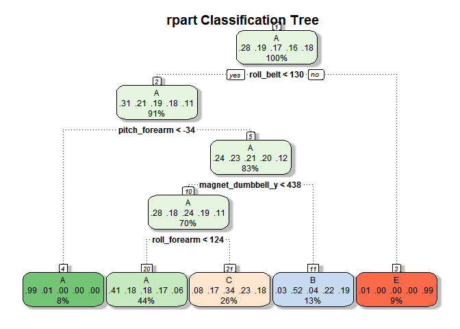

# Practical Machine Learning Project: Exercise Class Prediction
Dean Woodley  
April 4, 2017  

##Exercise Class Prediction  
##Introduction  
This paper presents the results of the development and selection of a model to predict
the which of five classes of exercises were performed by six test subjects. The subjects were asked to perform barbell lifts correctly and incorrectly in five different ways. The data was provided by groupware@les.inf.puc-rio.br at this internet address: http://groupware.les.inf.puc-rio.br/har.


##Data Preparation  
The provided training data file consisted of 19,622 rows of observations with 
160 columns of potenetial prediction and identifying variables. The training data 
was randomly split on the classe feature between a training set (75%) and a testing set (25%).

Preliminary examination of the data indicated that a large number of the 
variables predominately contained NA or near zero variance values. Columns that 
contained over 50% NA values where removed from the final data sets, as were columns 
that had near zero variances. In addition, columns containing row identifiers, 
test subject names, and time stamps were removed. A total of 53 predictor columns
remained after preprocessing.

    
##Model Selection and Cross Validation  
Four (4) potenetial prediction methods were fitted to the preprocessed training data:    
    Classification Tree Model (rpart);  
    Random Forests Model (rf);  
    Boosting with Trees Model (gbm);  
    Bagging with Trees Model (treeebag)    

Each model was fitted using k-fold (k = 5) cross validation with the intent to reduce variance
of the fit. The fitted models were then used to predict against the training data in order to 
obtain a best case estimate of model accuracy.

The accuracy against the training data were as follow:  
    Classification Tree Model (rpart):      50.14 %  
    Random Forests Model (rf):             100    %  
    Boosting with Trees Model (gbm):        99.46 %  
    Bagging with Trees Model (treeebag):    99.99 %  
        
The Classification Tree Model was seen to be very much inferior to the other models
tested, though the possibility of overfitting with the other models (particularly Random Forests)
is a concern.

As an additional check for accuracy, and the possibility of overfitting, the models 
were used to predict against testing data that was held out from the original training set. 
The prediction accuracy of the four models against the testing data was very close to 
that of the training data, so the possibility of overfitting is assumed to be negligeable.

The accuracy against the testing data were as follow:  
    Classification Tree Model (rpart):      47.94 %  
    Random Forests Model (rf):              99.9  %  
    Boosting with Trees Model (gbm):        99.16 %  
    Bagging with Trees Model (treeebag):    99.49 %  

Given the results of the models against the training and testing data sets
the Random Forest model was selected for the final validation prediction.    

##Prediction Results  
Predictions were performed on 20 test cases from the   "https://d396qusza40orc.cloudfront.net/predmachlearn/pml-testing.csv" data file.  
The results are as follows:  

Case 1 : B  
Case 2 : A  
Case 3 : B  
Case 4 : A  
Case 5 : A  
Case 6 : E  
Case 7 : D  
Case 8 : B  
Case 9 : A  
Case 10 : A  
Case 11 : B  
Case 12 : C  
Case 13 : B  
Case 14 : A  
Case 15 : E  
Case 16 : E  
Case 17 : A  
Case 18 : B  
Case 19 : B  
Case 20 : B  


##Data Preparation  
####Load Training Files; Split between Training and Testing sets (75%/25%)  

```r
set.seed(1111)
pmltrain <- read.csv("https://d396qusza40orc.cloudfront.net/predmachlearn/pml-training.csv")
```


```r
trainList <- createDataPartition(pmltrain$classe,p=0.75,list=FALSE)
trainData <- pmltrain[trainList,]
TestData <- pmltrain[-trainList,]
```
####Input Data Frame Dimensions  

```
## [1] 19622   160
```

####Training Data Frame Dimensions  

```
## [1] 14718   160
```

####Testing Data Frame Dimensions  

```
## [1] 4904  160
```

####Vector of columns that are near zero variance  

```r
nms <- colnames(trainData[,nearZeroVar(trainData)])
```


####Vector of columns that are timestamps, row numbers or characters  

```r
nms <- c(nms,"X","user_name","raw_timestamp_part_1","raw_timestamp_part_2","cvtd_timestamp")
```

####Vector of columns that are over 50% NAs  

```r
for(nm in colnames(trainData))
{
    if(sum(is.na(trainData[,nm]))/length(trainData[,nm]) > 0.50) 
    {
        nms <- c(nms,nm)
    }
}
```

####Remove columns that are NAs or near zero variance  

```r
NACols <- colnames(trainData) %in% nms
trainData <- trainData[,!NACols]
```

####Revised Training Data Frame Dimensions:  

```r
print(dim(trainData))
```

```
## [1] 14718    54
```


##Train four models: Classification Tree, Random Forests, Boosting with Trees, Bagging  
####Train Classification Tree Model (rpart)  

```r
set.seed(1111)
tc <- trainControl(method="CV",number=5)
XtrainMod <- train(classe~.,method="rpart",trControl=tc,data=trainData) 
```

```
## CART 
## 
## 14718 samples
##    53 predictor
##     5 classes: 'A', 'B', 'C', 'D', 'E' 
## 
## No pre-processing
## Resampling: Cross-Validated (5 fold) 
## Summary of sample sizes: 11774, 11775, 11775, 11775, 11773 
## Resampling results across tuning parameters:
## 
##   cp          Accuracy   Kappa     
##   0.03778601  0.5486445  0.42297595
##   0.06164752  0.3939449  0.17081860
##   0.11829488  0.3157995  0.04789891
## 
## Accuracy was used to select the optimal model using  the largest value.
## The final value used for the model was cp = 0.03778601.
```

####Train Random Forests Model (rf)  

```r
XtrainMod2 <- train(classe~.,method="rf",trControl=tc,data=trainData)
```

```
## Random Forest 
## 
## 14718 samples
##    53 predictor
##     5 classes: 'A', 'B', 'C', 'D', 'E' 
## 
## No pre-processing
## Resampling: Cross-Validated (5 fold) 
## Summary of sample sizes: 11774, 11776, 11774, 11774, 11774 
## Resampling results across tuning parameters:
## 
##   mtry  Accuracy   Kappa    
##    2    0.9946324  0.9932103
##   27    0.9975541  0.9969061
##   53    0.9948362  0.9934683
## 
## Accuracy was used to select the optimal model using  the largest value.
## The final value used for the model was mtry = 27.
```


####Train Boosting with Trees Model (gbm)  

```r
XtrainMod3 <- train(classe~.,method = "gbm",trControl=tc,data=trainData,verbose=FALSE)
```

```
## Stochastic Gradient Boosting 
## 
## 14718 samples
##    53 predictor
##     5 classes: 'A', 'B', 'C', 'D', 'E' 
## 
## No pre-processing
## Resampling: Cross-Validated (5 fold) 
## Summary of sample sizes: 11774, 11776, 11773, 11775, 11774 
## Resampling results across tuning parameters:
## 
##   interaction.depth  n.trees  Accuracy   Kappa    
##   1                   50      0.7632870  0.6997372
##   1                  100      0.8322496  0.7876319
##   1                  150      0.8724719  0.8386004
##   2                   50      0.8834092  0.8523613
##   2                  100      0.9368812  0.9201339
##   2                  150      0.9635831  0.9539215
##   3                   50      0.9319892  0.9138939
##   3                  100      0.9697659  0.9617451
##   3                  150      0.9862080  0.9825529
## 
## Tuning parameter 'shrinkage' was held constant at a value of 0.1
## 
## Tuning parameter 'n.minobsinnode' was held constant at a value of 10
## Accuracy was used to select the optimal model using  the largest value.
## The final values used for the model were n.trees = 150,
##  interaction.depth = 3, shrinkage = 0.1 and n.minobsinnode = 10.
```


####Train Bagging Model (treebag)  

```r
XtrainMod4 <- train(classe~.,method = "treebag",trControl=tc,data=trainData,verbose=FALSE) 
```

```
## Bagged CART 
## 
## 14718 samples
##    53 predictor
##     5 classes: 'A', 'B', 'C', 'D', 'E' 
## 
## No pre-processing
## Resampling: Cross-Validated (5 fold) 
## Summary of sample sizes: 11773, 11776, 11774, 11774, 11775 
## Resampling results:
## 
##   Accuracy   Kappa    
##   0.9934097  0.9916642
## 
## 
```

##Check accuracy of each model against training data  
####Test rpart (Classification Tree) on training data.  

```r
RpartTrainPred <- predict(XtrainMod,newdata=trainData)
table(cbind(data.frame(RpartTrainPred),data.frame(trainData$classe)))
```

```
##               trainData.classe
## RpartTrainPred    A    B    C    D    E
##              A 3815 1182 1176 1095  394
##              B   65  997   82  427  359
##              C  293  669 1309  890  695
##              D    0    0    0    0    0
##              E   12    0    0    0 1258
```

```r
print(paste("Training Data Accuracy:",round(100*sum(RpartTrainPred == trainData$classe)/length(trainData$classe),2),"%"))
```

```
## [1] "Training Data Accuracy: 50.14 %"
```

####Plot of rpart Classification Tree  
<!-- -->

####Test rf (Random Forest) on training data.  

```r
RfTrainPred <- predict(XtrainMod2,newdata=trainData)

table(cbind(data.frame(RfTrainPred),data.frame(trainData$classe)))
```

```
##            trainData.classe
## RfTrainPred    A    B    C    D    E
##           A 4185    0    0    0    0
##           B    0 2848    0    0    0
##           C    0    0 2567    0    0
##           D    0    0    0 2412    0
##           E    0    0    0    0 2706
```

```r
print(paste("Training Data Accuracy:",round(100*sum(RfTrainPred ==  trainData$classe)/length(trainData$classe),2),"%"))
```

```
## [1] "Training Data Accuracy: 100 %"
```

####Test gbm (Boosting with Trees) on training data.  

```r
GbmTrainPred <- predict(XtrainMod3,newdata=trainData)

table(cbind(data.frame(GbmTrainPred),data.frame(trainData$classe)))
```

```
##             trainData.classe
## GbmTrainPred    A    B    C    D    E
##            A 4184    9    0    2    0
##            B    1 2828   12    4    4
##            C    0   11 2552   16    5
##            D    0    0    3 2388   13
##            E    0    0    0    2 2684
```

```r
print(paste("Training Data Accuracy:",round(100*sum(GbmTrainPred ==  trainData$classe)/length(trainData$classe),2),"%"))
```

```
## [1] "Training Data Accuracy: 99.44 %"
```

####Test treeebag (Bagging with Trees) on training data.  

```r
TreebagTrainPred <- predict(XtrainMod4,newdata=trainData)

table(cbind(data.frame(TreebagTrainPred),data.frame(trainData$classe)))
```

```
##                 trainData.classe
## TreebagTrainPred    A    B    C    D    E
##                A 4184    0    0    0    0
##                B    1 2848    0    0    0
##                C    0    0 2567    0    0
##                D    0    0    0 2412    0
##                E    0    0    0    0 2706
```

```r
print(paste("Training Data Accuracy:",round(100*sum(TreebagTrainPred == trainData$classe)/length(trainData$classe),2),"%"))
```

```
## [1] "Training Data Accuracy: 99.99 %"
```


###################################################################################################
##Test section.  
###Remove columns that are not in the training data set  

```r
cnames <- colnames(trainData)

TestData <- TestData[,cnames]
```

###Predict and check accuracy of each model agains testing data  
####Rpart (Classification Trees)  

```r
RpartTestPred <- predict(XtrainMod,newdata=TestData)

table(cbind(data.frame(RpartTestPred),data.frame(TestData$classe)))
```

```
##              TestData.classe
## RpartTestPred    A    B    C    D    E
##             A 1264  399  410  352  129
##             B   22  296   27  145  131
##             C  107  254  418  307  268
##             D    0    0    0    0    0
##             E    2    0    0    0  373
```

```r
print(paste("Testing Data Accuracy:",round(100*sum(RpartTestPred==TestData$classe)/length(TestData$classe),2),"%"))
```

```
## [1] "Testing Data Accuracy: 47.94 %"
```

####rf (Random Forest)  

```r
RfTestPred <- predict(XtrainMod2,newdata=TestData)

table(cbind(data.frame(RfTestPred),data.frame(TestData$classe)))
```

```
##           TestData.classe
## RfTestPred    A    B    C    D    E
##          A 1395    2    0    0    0
##          B    0  947    1    0    0
##          C    0    0  854    2    0
##          D    0    0    0  802    0
##          E    0    0    0    0  901
```

```r
print(paste("Testing Data Accuracy:",round(100*sum(RfTestPred == TestData$classe)/length(TestData$classe),2),"%"))
```

```
## [1] "Testing Data Accuracy: 99.9 %"
```

####gbm (Boosting Using Trees)  

```r
GbmTestPred <- predict(XtrainMod3,newdata=TestData)

table(cbind(data.frame(GbmTestPred),data.frame(TestData$classe)))
```

```
##            TestData.classe
## GbmTestPred    A    B    C    D    E
##           A 1392    4    0    0    0
##           B    3  937    7    1    4
##           C    0    8  845    9    0
##           D    0    0    2  794    5
##           E    0    0    1    0  892
```

```r
print(paste("Testing Data Accuracy:",round(100*sum(GbmTestPred == TestData$classe)/length(TestData$classe),2),"%"))
```

```
## [1] "Testing Data Accuracy: 99.1 %"
```

####treebag (Bagging Using Trees)  

```r
TreebagTestPred <- predict(XtrainMod4,newdata=TestData)

table(cbind(data.frame(TreebagTestPred),data.frame(TestData$classe)))
```

```
##                TestData.classe
## TreebagTestPred    A    B    C    D    E
##               A 1394    6    0    0    0
##               B    1  939    1    4    3
##               C    0    4  853    5    2
##               D    0    0    1  794    6
##               E    0    0    0    1  890
```

```r
print(paste("Testing Data Accuracy:",round(100*sum(TreebagTestPred== TestData$classe)/length(TestData$classe),2),"%"))
```

```
## [1] "Testing Data Accuracy: 99.31 %"
```


###################################################################################################
##Validation section.  

```r
pmlValidate <- read.csv("https://d396qusza40orc.cloudfront.net/predmachlearn/pml-testing.csv")
```

####Remove columns that are not in the training data set  

```r
ExCols <- colnames(pmlValidate) %in% nms

pmlValidate <- pmlValidate[,!ExCols]
```

####Create predictions using Random Forest model on validation data  

```r
RfValidPred <- predict(XtrainMod2,newdata=pmlValidate)
```

####Predictions of classes from validation data  

```r
for(i in 1:length(RfValidPred)) print(paste("Case",i,":",RfValidPred[i]))
```

```
## [1] "Case 1 : B"
## [1] "Case 2 : A"
## [1] "Case 3 : B"
## [1] "Case 4 : A"
## [1] "Case 5 : A"
## [1] "Case 6 : E"
## [1] "Case 7 : D"
## [1] "Case 8 : B"
## [1] "Case 9 : A"
## [1] "Case 10 : A"
## [1] "Case 11 : B"
## [1] "Case 12 : C"
## [1] "Case 13 : B"
## [1] "Case 14 : A"
## [1] "Case 15 : E"
## [1] "Case 16 : E"
## [1] "Case 17 : A"
## [1] "Case 18 : B"
## [1] "Case 19 : B"
## [1] "Case 20 : B"
```

